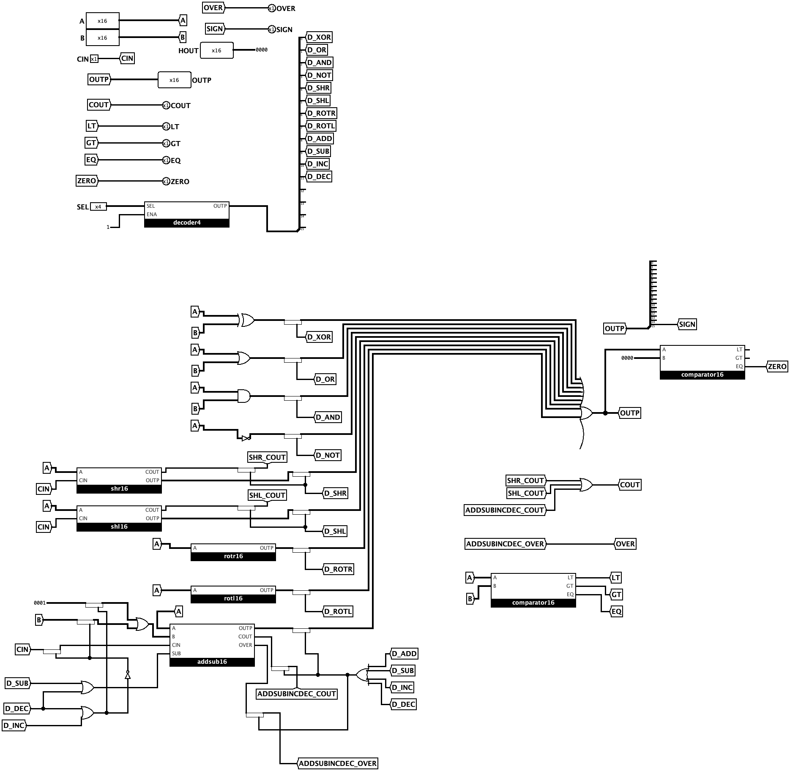
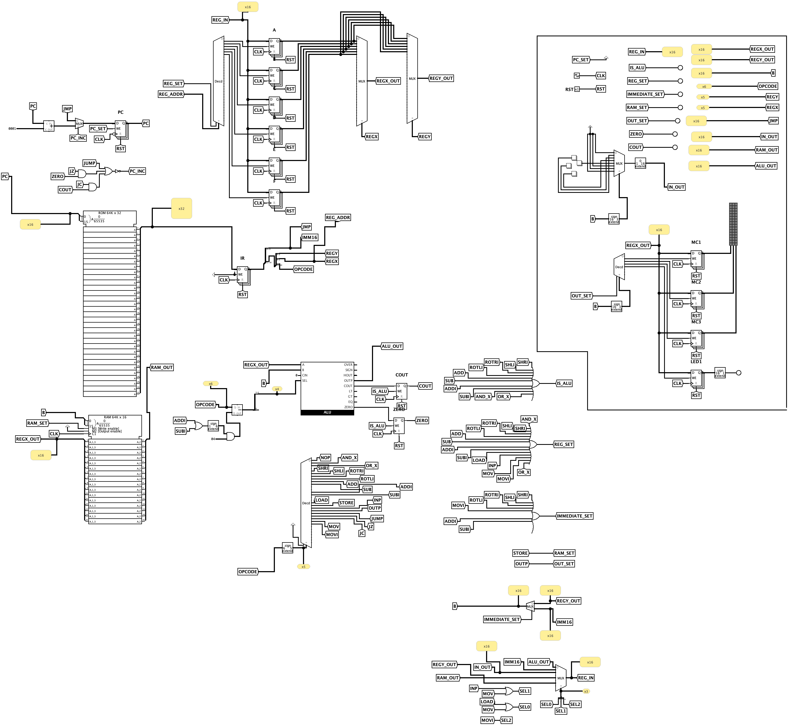
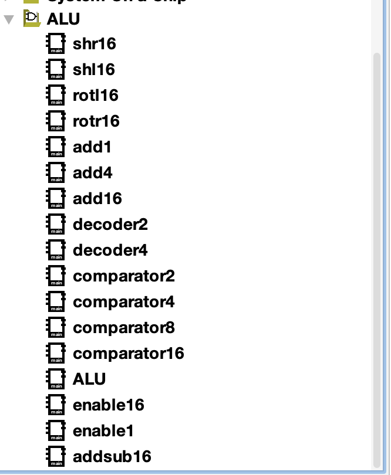

# 16-bit CPU in Logisim

Custom educational 16-bit CPU design implemented in Logisim, including ALU, control flow, memory/I/O instructions, and a demo program.

## Overview

- 16-bit data path
- 32-bit instruction format
- General-purpose registers `R1–R6`
- ALU operations, memory access, branching, and I/O instructions
- Demo program for testing functionality

## Architecture

### ALU

### CPU

### ALU Components

## Game Demo

- [Watch / download demo video](video.mp4)

## Project Files

- [Detailed CPU documentation](dokumentace.md)
- [Program listing / machine code output](program.txt)
- `ALU.circ` – ALU circuit
- `CPU.circ` – CPU top-level circuit
- `program.asm` – assembly source

## How to Use

1. Open `CPU.circ` in Logisim.
2. Load program data into ROM (from your assembled output).
3. Run simulation and observe register/memory/I/O behavior.

